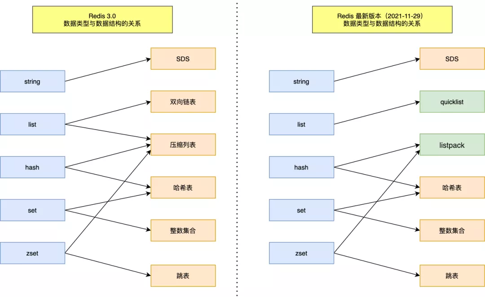
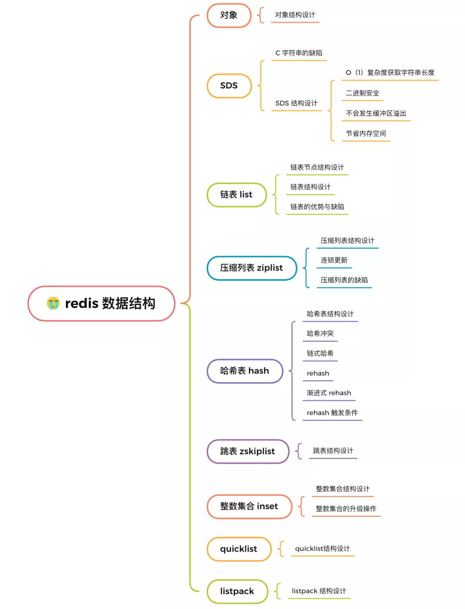
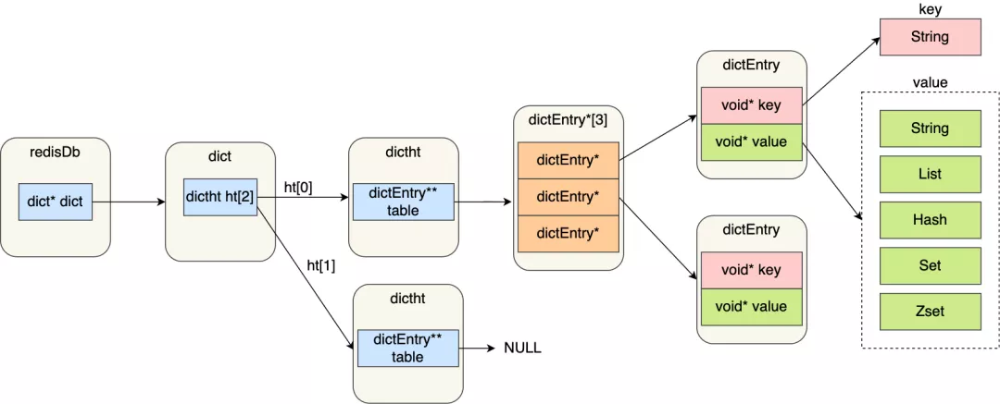
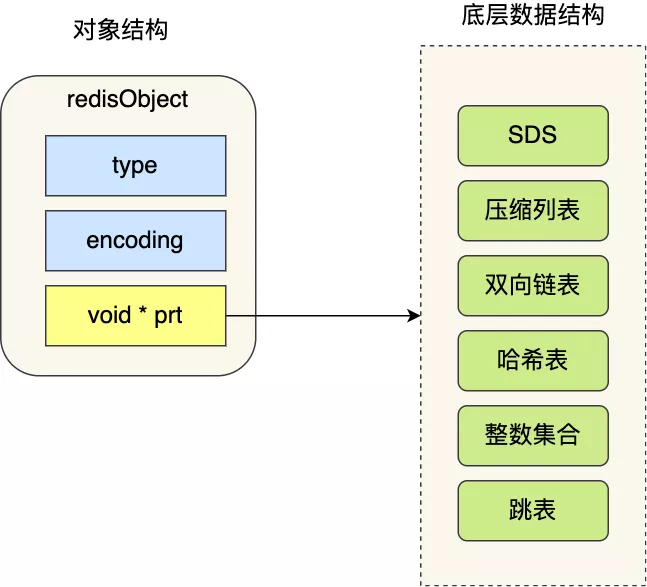
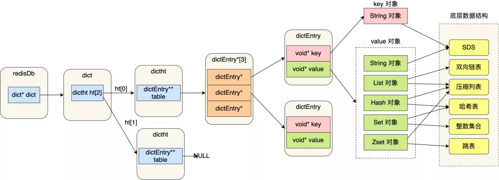

# 前言

Redis 为什么那么快？

除了它是内存数据库，使得所有的操作都在内存上进行之外，还有一个重要因素，它实现的数据结构，使得我们对数据进行增删查改操作时，Redis 能高效的处理。

因此，这次我们就来好好聊一下 Redis 数据结构，这个在面试中太常问了。

```
注意:
Redis 数据结构并不是指 String（字符串）对象、List（列表）对象、Hash（哈希）对象、Set（集合）对象和 Zset（有序集合）对象，
因为这些是 Redis 键值对中值的数据类型，也就是数据的保存形式，这些对象的底层实现的方式就用到了数据结构。
```

我画了一张 Redis 数据类型（也叫 Redis 对象）和底层数据结构的对应关图，左边是 Redis 3.0版本的，也就是《Redis 设计与实现》这本书讲解的版本，
现在看还是有点过时了，右边是现在 Github 最新的 Redis 代码的（还未发布正式版本）。



可以看到，Redis 数据类型的底层数据结构随着版本的更新也有所不同，比如：

```
在 Redis 3.0 版本中 List 对象的底层数据结构由「双向链表」或「压缩表列表」实现，但是在 3.2 版本之后，List 数据类型底层数据结构是由 quicklist 实现的；

在最新的 Redis 代码（还未发布正式版本）中，压缩列表数据结构已经废弃了，交由 listpack 数据结构来实现了。
```

这次，小林把新旧版本的数据结构说图解一遍，共有 9 种数据结构：SDS、双向链表、压缩列表、哈希表、跳表、整数集合、quicklist、listpack。

不多 BB 了，直接发车！



## 键值对数据库是怎么实现的？

在开始讲数据结构之前，先给介绍下 Redis 是怎样实现键值对（key-value）数据库的。

Redis 的键值对中的 key 就是字符串对象，而 value 可以是字符串对象，也可以是集合数据类型的对象，比如 List 对象、Hash 对象、Set 对象和 Zset 对象。

举个例子，我这里列出几种 Redis 新增键值对的命令：

```
> SET name "xiaolincoding"
OK

> HSET person name "xiaolincoding" age 18
0

> RPUSH stu "xiaolin" "xiaomei"
(integer) 4
```

这些命令代表着：

```
第一条命令：name 是一个字符串键，因为键的值是一个字符串对象；

第二条命令：person 是一个哈希表键，因为键的值是一个包含两个键值对的哈希表对象；

第三条命令：stu 是一个列表键，因为键的值是一个包含两个元素的列表对象；
```

>1.这些键值对是如何保存在 Redis 中的呢？

```
Redis 是使用了一个「哈希表」保存所有键值对，哈希表的最大好处就是让我们可以用 O(1) 的时间复杂度来快速查找到键值对。
哈希表其实就是一个数组，数组中的元素叫做哈希桶。
```

>2.Redis 的哈希桶是怎么保存键值对数据的呢？

哈希桶存放的是指向键值对数据的指针（dictEntry*），这样通过指针就能找到键值对数据，然后因为键值对的值可以保存字符串对象和集合数据类型的对象，
所以键值对的数据结构中并不是直接保存值本身，而是保存了 void * key 和 void * value 指针，分别指向了实际的键对象和值对象，
这样一来，即使值是集合数据，也可以通过 void * value 指针找到。

我这里画了一张 Redis 保存键值对所涉及到的数据结构。



这些数据结构的内部细节，我先不展开讲，后面在讲哈希表数据结构的时候，在详细的说说，因为用到的数据结构是一样的。
这里先大概说下图中涉及到的数据结构的名字和用途：

```
1. redisDb 结构，表示 Redis 数据库的结构，结构体里存放了指向了 dict 结构的指针；

2. dict 结构，结构体里存放了 2 个哈希表，正常情况下都是用「哈希表1」，「哈希表2」只有在 rehash 的时候才用，具体什么是 rehash，我在本文的哈希表数据结构会讲；

3. ditctht 结构，表示哈希表的结构，结构里存放了哈希表数组，数组中的每个元素都是指向一个哈希表节点结构（dictEntry）的指针；

4. dictEntry 结构，表示哈希表节点的结构，结构里存放了 void * key 和 void * value 指针， *key 指向的是 String 对象，而 *value 则可以指向 String 对象，也可以指向集合类型的对象，比如 List 对象、Hash 对象、Set 对象和 Zset 对象。
```

特别说明下，void * key 和 void * value 指针指向的是 Redis 对象，Redis 中的每个对象都由 redisObject 结构表示，如下图：



对象结构里包含的成员变量：

```
1. type，标识该对象是什么类型的对象（String 对象、 List 对象、Hash 对象、Set 对象和 Zset 对象）；

2. encoding，标识该对象使用了哪种底层的数据结构；

3. ptr，指向底层数据结构的指针。
```

我画了一张 Redis 键值对数据库的全景图，你就能清晰知道 Redis 对象和数据结构的关系了：



接下里，就好好聊一下底层数据结构！

# SDS

字符串在 Redis 中是很常用的，键值对中的键是字符串类型，值有时也是字符串类型。

Redis 是用 C 语言实现的，但是它没有直接使用 C 语言的 char* 字符数组来实现字符串，而是自己封装了一个名为简单动态字符串（simple dynamic string，SDS） 的数据结构来表示字符串，也就是 Redis 的 String 数据类型的底层数据结构是 SDS。

既然 Redis 设计了 SDS 结构来表示字符串，肯定是 C 语言的 char* 字符数组存在一些缺陷。

要了解这一点，得先来看看 char* 字符数组的结构。


# 链表

大家最熟悉的数据结构除了数组之外，我相信就是链表了。

Redis 的 List 对象的底层实现之一就是链表。C 语言本身没有链表这个数据结构的，所以 Redis 自己设计了一个链表数据结构。

链表节点结构设计

先来看看「链表节点」结构的样子：

```
typedef struct listNode {
    //前置节点
    struct listNode *prev;
    //后置节点
    struct listNode *next;
    //节点的值
    void *value;
} listNode;
```

有前置节点和后置节点，可以看的出，这个是一个双向链表。

链表结构设计

不过，Redis 在 listNode 结构体基础上又封装了 list 这个数据结构，这样操作起来会更方便，链表结构如下：

```
typedef struct list {
    //链表头节点
    listNode *head;
    //链表尾节点
    listNode *tail;
    //节点值复制函数
    void *(*dup)(void *ptr);
    //节点值释放函数
    void (*free)(void *ptr);
    //节点值比较函数
    int (*match)(void *ptr, void *key);
    //链表节点数量
    unsigned long len;
} list;
```

list 结构为链表提供了链表头指针 head、链表尾节点 tail、链表节点数量 len、以及可以自定义实现的 dup、free、match 函数。

举个例子，下面是由 list 结构和 3 个 listNode 结构组成的链表。


链表的优势与缺陷

Redis 的链表实现优点如下：

```
listNode 链表节点的结构里带有 prev 和 next 指针，获取某个节点的前置节点或后置节点的时间复杂度只需O(1)，而且这两个指针都可以指向 NULL，所以链表是无环链表；

list 结构因为提供了表头指针 head 和表尾节点 tail，所以获取链表的表头节点和表尾节点的时间复杂度只需O(1)；

list 结构因为提供了链表节点数量 len，所以获取链表中的节点数量的时间复杂度只需O(1)；

listNode 链表节使用 void* 指针保存节点值，并且可以通过 list 结构的 dup、free、match 函数指针为节点设置该节点类型特定的函数，因此链表节点可以保存各种不同类型的值；
```

链表的缺陷也是有的：

```
链表每个节点之间的内存都是不连续的，意味着无法很好利用 CPU 缓存。能很好利用 CPU 缓存的数据结构就是数组，因为数组的内存是连续的，这样就可以充分利用 CPU 缓存来加速访问。

还有一点，保存一个链表节点的值都需要一个链表节点结构头的分配，内存开销较大。
```

因此，Redis 3.0 的 List 对象在数据量比较少的情况下，会采用「压缩列表」作为底层数据结构的实现，它的优势是节省内存空间，并且是内存紧凑型的数据结构。

不过，压缩列表存在性能问题（具体什么问题，下面会说），所以 Redis 在 3.2 版本设计了新的数据结构 quicklist，并将 List 对象的底层数据结构改由 quicklist 实现。

然后在  Redis 5.0 设计了新的数据结构 listpack，沿用了压缩列表紧凑型的内存布局，最终在最新的 Redis 版本，将 Hash 对象和 Zset 对象的底层数据结构实现之一的压缩列表，替换成由  listpack 实现。

# 压缩列表

压缩列表的最大特点，就是它被设计成一种内存紧凑型的数据结构，占用一块连续的内存空间，不仅可以利用 CPU 缓存，而且会针对不同长度的数据，进行相应编码，这种方法可以有效地节省内存开销。

但是，压缩列表的缺陷也是有的：

```
不能保存过多的元素，否则查询效率就会降低；

新增或修改某个元素时，压缩列表占用的内存空间需要重新分配，甚至可能引发连锁更新的问题。
```

因此，Redis 对象（List 对象、Hash 对象、Zset 对象）包含的元素数量较少，或者元素值不大的情况才会使用压缩列表作为底层数据结构。

接下来，就跟大家详细聊下压缩列表。

## 压缩列表结构设计

压缩列表是 Redis 为了节约内存而开发的，它是由连续内存块组成的顺序型数据结构，有点类似于数组。

https://mp.weixin.qq.com/s/CeuO2n1YZwBXw56WvafctA


  