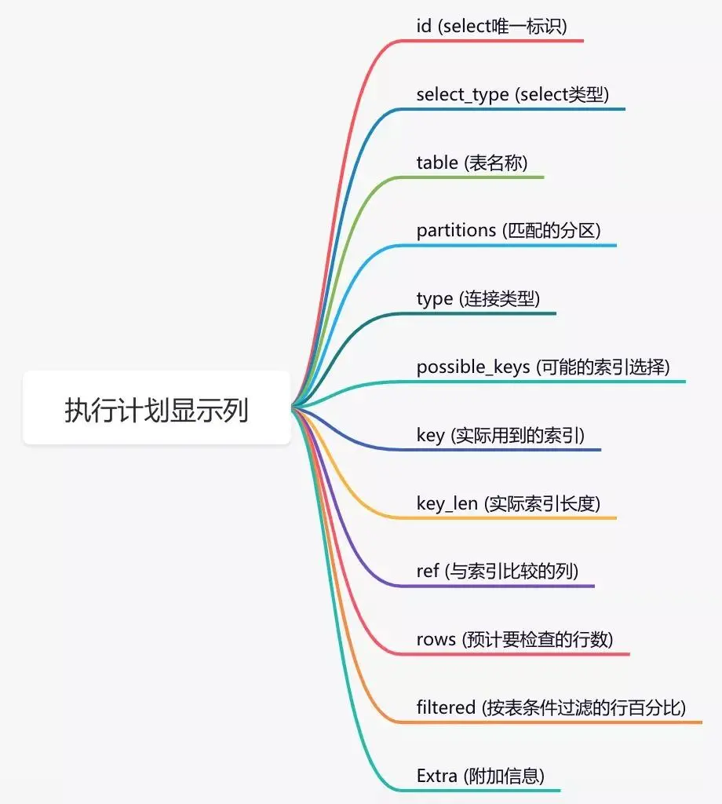

# SQL查询按此顺序进行

```
 FROM/JOIN 和所有的 ON 条件
 WHERE
 GROUP BY
 HAVING
 SELECT（包括窗口函数）
 ORDER BY
 LIMIT
```

图解此图有助于你做出回答

此图是关于SQL查询的语义的 — 你可以通过它，对给定查询将返回什么结果进行推理，并回答如下问题：
(1) 我能在一个GROUP BY的结果上执行WHERE么？（不行！WHERE发生在GROUP BY之前！）
(2) 我可以根据窗口函数的结果进行过滤吗（不行！窗口函数发生在SELECT中，它发生在WHERE和GROUP BY之后）
(3) 我可以基于GROUP BY中所做的来进行ORDER BY么？（可以！ORDER BY是最后执行的基本步骤，你可以根据任何东西做ORDER BY！）
(4) LIMIT何时执行？（在最后！）


# 数据库引擎实际并不是按这个顺序运行查询

因为它实现了一系列优化以使查询运行得更快 — 我们稍后将在本文中讨论这一点。
所以：
(1) 当你只想了解哪些查询是有效的，以及如何推理给定查询的结果时，可以使用此图。
(2) 你不应该使用此图来解释查询性能或任何有关索引的事情，那是一个复杂得多的问题，涉及更多变量。

# 混淆因素：列别名

有人在Twitter上指出，许多SQL实现允许你使用以下语法：
```sql
SELECT CONCAT(first_name, ' ', last_name) AS full_name, count(*)
FROM table
GROUP BY full_name
```
此查询使其看起来像是在SELECT之后才发生GROUP BY，即使GROUP BY先执行，因为GROUP BY引用了SELECT中的别名。但是要使GROUP BY发挥作用，其实并不需要在SELECT之后才运行 — 数据库引擎只要将查询重写为：

```sql
SELECT CONCAT(first_name, ' ', last_name) AS full_name, count(*)
FROM table
GROUP BY CONCAT(first_name, ' ', last_name)
```
并且首先运行GROUP BY。

你的数据库引擎肯定还会在开始运行查询之前执行一系列检查，确保你在SELECT和GROUP BY中放置的内容合在一起是有意义的，因此在开始制定执行计划之前，它必须将查询作为一个整体来查看。


# 查询实际上不是按此顺序运行的（优化！）

实际上，数据库引擎并不是真的通过连接、然后过滤、然后再分组来运行查询，因为它们实现了一系列优化，只要重新排列执行顺序不改变查询结果，就可以重排以使查询运行得更快。

一个简单的例子说明了为什么需要以不同的顺序运行查询以使其快速运行，在这个查询中：

```sql
SELECT * FROM
owners LEFT JOIN cats ON owners.id = cats.owner
WHERE cats.name = 'mr darcy'
```

如果你只需要查找3个名为“mr darcy”的猫，那么执行整个左连接并匹配这两个表中的所有行是非常愚蠢的 —— 首先对名为“mr darcy”的猫进行一些筛选要快得多。在这种情况下，先进行过滤不会改变查询结果！
实际上，数据库引擎还实现了许多其它优化，这些优化可能会使它们以不同的顺序运行查询，但不能再说了，老实讲，这方面我不是专家。


# 索引优化

你通过查看线上日志或者监控报告，查到某个接口用到的某条sql语句耗时比较长。

这时你可能会有下面这些疑问：

```
该sql语句加索引了没？
加的索引生效了没？
mysql选错索引了没？
```

## 1.1 没加索引

sql语句中where条件的关键字段，或者order by后面的排序字段，忘了加索引，这个问题在项目中很常见。

## 1.2 索引没生效

那么，如何查看索引有没有生效呢？

答：可以使用explain命令，查看mysql的执行计划，它会显示索引的使用情况。

例如：

```
explain select * from `order` where code='002';
```

通过这几列可以判断索引使用情况，执行计划包含列的含义如下图所示：




