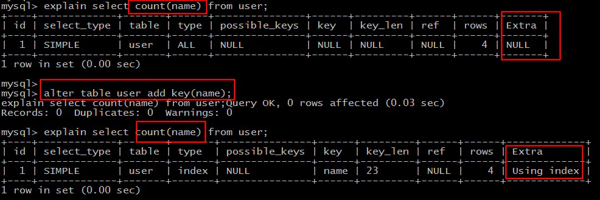

# 什么是覆盖索引 (Covering index)

MySQL官网，类似的说法出现在explain查询计划优化章节，即explain的输出结果Extra字段为Using index时，能够触发索引覆盖。

不管是SQL-Server官网，还是MySQL官网，都表达了：只需要在一棵索引树上就能获取SQL所需的所有列数据，无需回表，速度更快。

## 如何实现覆盖索引？

常见的方法是：将被查询的字段，建立到联合索引里去。

建表语句 1： 

```sql
create table user (

id int primary key,

name varchar(20),

sex varchar(5),

index(name)

)engine=innodb;
```

第一个SQL语句：

```sql
select id,name from user where name='shenjian';
```

能够命中name索引，索引叶子节点存储了主键id，通过name的索引树即可获取id和name，无需回表，符合索引覆盖，效率较高。

```
画外音，Extra：Using index。
```

第二个SQL语句：

```sql
select id,name,sex from user where name='shenjian';
```

能够命中name索引，索引叶子节点存储了主键id，但sex字段必须回表查询才能获取到，不符合索引覆盖，需要再次通过id值扫码聚集索引获取sex字段，效率会降低。

```
画外音，Extra：Using index condition。
```

如果把(name)单列索引升级为联合索引(name, sex)就不同了。

建表语句 2：
```sql
create table user (

id int primary key,

name varchar(20),

sex varchar(5),

index(name, sex)

)engine=innodb;
```

可以看到：

```sql
select id,name ... where name='shenjian';

select id,name,sex* ... where name='shenjian';
```

```
画外音，Extra：Using index。
```

## 哪些场景可以利用索引覆盖来优化SQL？

### 场景1：全表count查询优化



原表为：

user(PK id, name, sex)；

直接：

select count(name) from user;

不能利用索引覆盖。

添加索引：

alter table user add key(name);

就能够利用索引覆盖提效。

### 场景2：列查询回表优化

```
select id,name,sex ... where name='shenjian';
```

这个例子不再赘述，将单列索引(name)升级为联合索引(name, sex)，即可避免回表。

### 场景3：分页查询

```sql
select id,name,sex ... order by name limit 500,100;
```

将单列索引(name)升级为联合索引(name, sex)，也可以避免回表。


