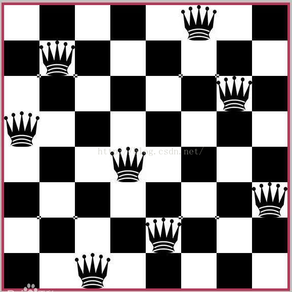

序言：

八皇后问题是学习回溯算法时不得不提的一个问题，用回溯算法解决该问题逻辑比较简单。

八皇后问题，是一个古老而著名的问题，是回溯算法的典型案例。

该问题是国际西洋棋棋手马克斯·贝瑟尔于1848年提出：在8×8格的国际象棋上摆放八个皇后，使其不能互相攻击，即任意两个皇后都不能处于同一行、同一列或同一斜线上，问有多少种摆法。

思路是按行来规定皇后，第一行放第一个皇后，第二行放第二个，然后通过遍历所有列，来判断下一个皇后能否放在该列。直到所有皇后都放完，或者放哪都不行。

详细一点说，第一个皇后先放第一行第一列，然后第二个皇后放在第二行第一列、然后判断是否OK，

然后第二列、第三列、依次把所有列都放完，找到一个合适，继续第三个皇后，还是第一列、第二列……直到第8个皇后也能放在一个不冲突的位置，算是找到了一个正确解。

然后回头继续第一个皇后放第二列，后面继续循环……

代码见：algorithm/trace/MiGong

