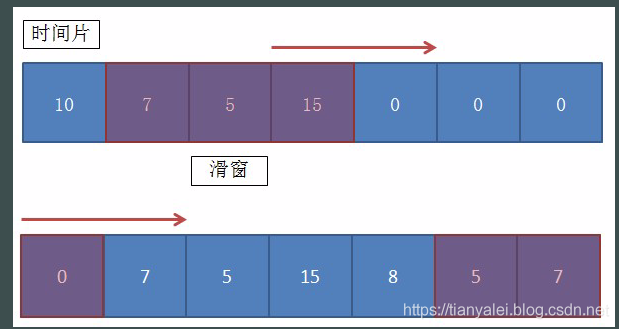

# 序言：

由于最近有一个统计单位时间内某key的访问次数的需求，譬如每5秒访问了redis的某key超过100次，就取出该key单独处理。

这样的单位时间统计，很明显我们都知道有个边界问题，譬如5秒内100次的限制。刚好前4.99秒访问都是0，最后0.01秒来了100次，5.01秒又来了100次。

也就是访问有明显的毛刺情况出现，为了弱化这个毛刺情况，我们可以采用滑动窗口。

#滑动窗口

滑动窗口的主要原理比较简单，就是将这个单位时间进行拆分，譬如5秒的统计范围，我们将它划分成5个1秒。

当请求进来时，先判断当前请求属于这5个1秒的时间片中的哪个，然后将对应的时间片对应的统计值加1，再判断当前加上前4个时间片的次数总和是否已经超过了设置的阈值。

当时间已经到达第6个时间片时，就把第一个时间片给干掉，因为无论第一片是多少个统计值，它都不会再参与后续的计算了。

就这样，随着时间的推移，统计值就随着各个时间片的滚动，不断地进行统计。

具体要将单位时间拆分为多少片，要根据实际情况来决定。当然，毫无疑问的是切分的越小，毛刺现象也越少。系统统计也越准确，随之就是内存占用会越大，因为你的这个窗口的数组会更大。

代码实现思路就是定义好分片数量，每个分片都有一个独立的计数器，所有的分片合计为一个数组。当请求来时，按照分片规则，判断请求应该划分到哪个分片中去。

要判断是否超过阈值，就将前N个统计值相加，对比定义的阈值即可。

代码请查看 algorithm/slidingwindow

