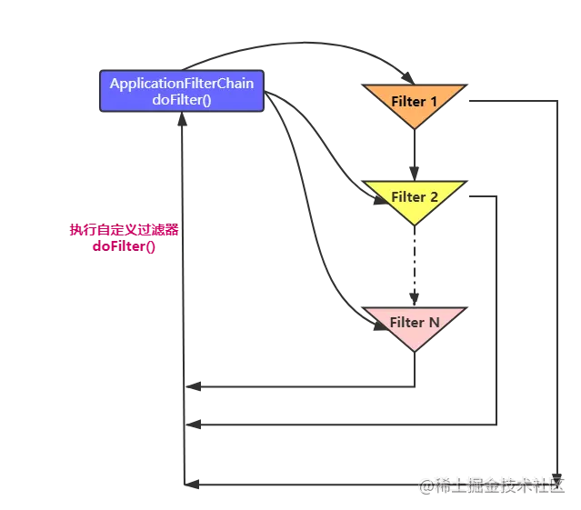
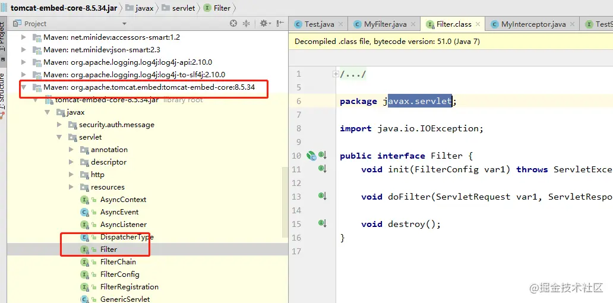
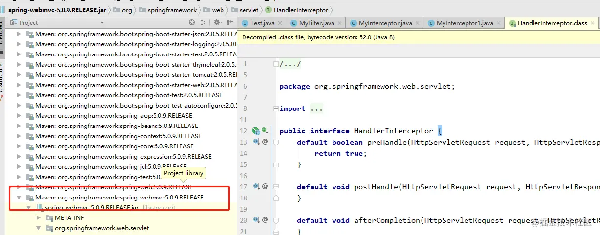

# 过滤器链与拦截器链的区别

## 1、过滤器 (Filter)
过滤器的配置比较简单，直接实现Filter 接口即可，也可以通过@WebFilter注解实现对特定URL拦截，看到Filter 接口中定义了三个方法。

- init() ：该方法在容器启动初始化过滤器时被调用，它在 Filter 的整个生命周期只会被调用一次。「注意」：这个方法必须执行成功，否则过滤器会不起作用。
- doFilter() ：容器中的每一次请求都会调用该方法， FilterChain 用来调用下一个过滤器 Filter。
- destroy()： 当容器销毁 过滤器实例时调用该方法，一般在方法中销毁或关闭资源，在过滤器 Filter 的整个生命周期也只会被调用一次

```java
@Component
public class MyFilter implements Filter {
    
    @Override
    public void init(FilterConfig filterConfig) throws ServletException {

        System.out.println("Filter 前置");
    }

    @Override
    public void doFilter(ServletRequest servletRequest, ServletResponse servletResponse, FilterChain filterChain) throws IOException, ServletException {

        System.out.println("Filter 处理中");
        filterChain.doFilter(servletRequest, servletResponse);
    }

    @Override
    public void destroy() {

        System.out.println("Filter 后置");
    }
}

```

## 2、拦截器 (Interceptor)

拦截器它是链式调用，一个应用中可以同时存在多个拦截器Interceptor， 一个请求也可以触发多个拦截器 ，而每个拦截器的调用会依据它的声明顺序依次执行。
首先编写一个简单的拦截器处理类，请求的拦截是通过HandlerInterceptor 来实现，看到HandlerInterceptor 接口中也定义了三个方法。

- preHandle() ：这个方法将在请求处理之前进行调用。「注意」：如果该方法的返回值为false ，将视为当前请求结束，不仅自身的拦截器会失效，还会导致其他的拦截器也不再执行。
- postHandle()：只有在 preHandle() 方法返回值为true 时才会执行。会在Controller 中的方法调用之后，DispatcherServlet 返回渲染视图之前被调用。 「有意思的是」：postHandle() 方法被调用的顺序跟 preHandle() 是相反的，先声明的拦截器  preHandle() 方法先执行，而postHandle()方法反而会后执行。
- afterCompletion()：只有在 preHandle() 方法返回值为true 时才会执行。在整个请求结束之后，  DispatcherServlet 渲染了对应的视图之后执行。

```java
@Component
public class MyInterceptor implements HandlerInterceptor {

    @Override
    public boolean preHandle(HttpServletRequest request, HttpServletResponse response, Object handler) throws Exception {

        System.out.println("Interceptor 前置");
        return true;
    }

    @Override
    public void postHandle(HttpServletRequest request, HttpServletResponse response, Object handler, ModelAndView modelAndView) throws Exception {

        System.out.println("Interceptor 处理中");
    }

    @Override
    public void afterCompletion(HttpServletRequest request, HttpServletResponse response, Object handler, Exception ex) throws Exception {

        System.out.println("Interceptor 后置");
    }
}

```

将自定义好的拦截器处理类进行注册，并通过addPathPatterns、excludePathPatterns等属性设置需要拦截或需要排除的 URL。

```java
@Configuration
public class MyMvcConfig implements WebMvcConfigurer {

    @Override
    public void addInterceptors(InterceptorRegistry registry) {
        registry.addInterceptor(new MyInterceptor()).addPathPatterns("/**");
        registry.addInterceptor(new MyInterceptor1()).addPathPatterns("/**");
    }
}

```

## 两者区别

过滤器 和 拦截器 均体现了AOP的编程思想，都可以实现诸如日志记录、登录鉴权等功能，但二者的不同点也是比较多的，接下来一一说明。

### 1、实现原理不同

过滤器和拦截器 底层实现方式大不相同，过滤器 是基于函数回调的，拦截器 则是基于Java的反射机制（动态代理）实现的。

这里重点说下过滤器！

在我们自定义的过滤器中都会实现一个 doFilter()方法，这个方法有一个FilterChain 参数，而实际上它是一个回调接口。ApplicationFilterChain是它的实现类， 这个实现类内部也有一个 doFilter() 方法就是回调方法。

```java
public interface FilterChain {
    void doFilter(ServletRequest var1, ServletResponse var2) throws IOException, ServletException;
}

```



ApplicationFilterChain里面能拿到我们自定义的xxxFilter类，在其内部回调方法doFilter()里调用各个自定义xxxFilter过滤器，并执行 doFilter() 方法。

```java
public final class ApplicationFilterChain implements FilterChain {
    @Override
    public void doFilter(ServletRequest request, ServletResponse response) {
            ...//省略
            internalDoFilter(request,response);
    }
 
    private void internalDoFilter(ServletRequest request, ServletResponse response){
    if (pos < n) {
            //获取第pos个filter    
            ApplicationFilterConfig filterConfig = filters[pos++];        
            Filter filter = filterConfig.getFilter();
            ...
            filter.doFilter(request, response, this);
        }
    }
 
}


```

而每个xxxFilter 会先执行自身的 doFilter() 过滤逻辑，最后在执行结束前会执行filterChain.doFilter(servletRequest, servletResponse)，也就是回调ApplicationFilterChain的doFilter() 方法，以此循环执行实现函数回调。


```
@Override
public void doFilter(ServletRequest servletRequest, ServletResponse servletResponse, FilterChain filterChain) throws IOException, ServletException {

    filterChain.doFilter(servletRequest, servletResponse);
}

```

### 2、使用范围不同

我们看到过滤器 实现的是 javax.servlet.Filter 接口，而这个接口是在Servlet规范中定义的，也就是说过滤器Filter 的使用要依赖于Tomcat等容器，导致它只能在web程序中使用。



而拦截器(Interceptor) 它是一个Spring组件，并由Spring容器管理，并不依赖Tomcat等容器，是可以单独使用的。不仅能应用在web程序中，也可以用于Application、Swing等程序中。



### 3、触发时机不同

过滤器 和 拦截器的触发时机也不同，我们看下边这张图。


过滤器Filter是在请求进入容器后，但在进入servlet之前进行预处理，请求结束是在servlet处理完以后。
拦截器 Interceptor 是在请求进入servlet后，在进入Controller之前进行预处理的，Controller 中渲染了对应的视图之后请求结束。

### 4、拦截的请求范围不同

在上边我们已经同时配置了过滤器和拦截器，再建一个Controller接收请求测试一下。

执行顺序 ：Filter 处理中 -> Interceptor 前置 -> 我是controller -> Interceptor 处理中 -> Interceptor 处理后

过滤器Filter执行了两次，拦截器Interceptor只执行了一次。这是因为过滤器几乎可以对所有进入容器的请求起作用，而拦截器只会对Controller中请求或访问static目录下的资源请求起作用。

### 5、注入Bean情况不同

在实际的业务场景中，应用到过滤器或拦截器，为处理业务逻辑难免会引入一些service服务。

下边我们分别在过滤器和拦截器中都注入service，看看有什么不同？

```java
@Component
public class TestServiceImpl implements TestService {

    @Override
    public void a() {
        System.out.println("我是方法A");
    }
}

```

过滤器中注入service，发起请求测试一下 ，日志正常打印出“我是方法A”。

```java
@Autowired
private TestService testService;

@Override
public void doFilter(ServletRequest servletRequest, ServletResponse servletResponse, FilterChain filterChain) throws IOException, ServletException {

    System.out.println("Filter 处理中");
    testService.a();
    filterChain.doFilter(servletRequest, servletResponse);
}

```

在拦截器中注入service，发起请求测试一下 ，竟然TM的报错了，debug跟一下发现注入的service怎么是Null啊？


这是因为加载顺序导致的问题，拦截器加载的时间点在springcontext之前，而Bean又是由spring进行管理。

> 拦截器：老子今天要进洞房； Spring：兄弟别闹，你媳妇我还没生出来呢！

解决方案也很简单，我们在注册拦截器之前，先将Interceptor 手动进行注入。

> 注意：在registry.addInterceptor()注册的是getMyInterceptor() 实例。

```java
@Configuration
public class MyMvcConfig implements WebMvcConfigurer {

    @Bean
    public MyInterceptor getMyInterceptor(){
        System.out.println("注入了MyInterceptor");
        return new MyInterceptor();
    }
    
    @Override
    public void addInterceptors(InterceptorRegistry registry) {

        registry.addInterceptor(getMyInterceptor()).addPathPatterns("/**");
    }
}

```

### 6、控制执行顺序不同

实际开发过程中，会出现多个过滤器或拦截器同时存在的情况，不过，有时我们希望某个过滤器或拦截器能优先执行，就涉及到它们的执行顺序。

过滤器用@Order注解控制执行顺序，通过@Order控制过滤器的级别，值越小级别越高越先执行。

```java
@Order(Ordered.HIGHEST_PRECEDENCE)
@Component
public class MyFilter2 implements Filter {

```

拦截器默认的执行顺序，就是它的注册顺序，也可以通过Order手动设置控制，值越小越先执行。

```java
@Override
public void addInterceptors(InterceptorRegistry registry) {
    registry.addInterceptor(new MyInterceptor2()).addPathPatterns("/**").order(2);
    registry.addInterceptor(new MyInterceptor1()).addPathPatterns("/**").order(1);
    registry.addInterceptor(new MyInterceptor()).addPathPatterns("/**").order(3);
}

```

看到输出结果发现，先声明的拦截器 preHandle() 方法先执行，而postHandle()方法反而会后执行。

postHandle() 方法被调用的顺序跟 preHandle() 居然是相反的！如果实际开发中严格要求执行顺序，那就需要特别注意这一点。

```
Interceptor1 前置
Interceptor2 前置
Interceptor 前置
我是controller
Interceptor 处理中
Interceptor2 处理中
Interceptor1 处理中
Interceptor 后置
Interceptor2 处理后
Interceptor1 处理后


```

「那为什么会这样呢？」  得到答案就只能看源码了，我们要知道controller 中所有的请求都要经过核心组件DispatcherServlet路由，都会执行它的 doDispatch() 方法，而拦截器postHandle()、preHandle()方法便是在其中调用的。

```
protected void doDispatch(HttpServletRequest request, HttpServletResponse response) throws Exception {
    
        try {
         ...........
            try {
           
                // 获取可以执行当前Handler的适配器
                HandlerAdapter ha = getHandlerAdapter(mappedHandler.getHandler());

                // Process last-modified header, if supported by the handler.
                String method = request.getMethod();
                boolean isGet = "GET".equals(method);
                if (isGet || "HEAD".equals(method)) {
                    long lastModified = ha.getLastModified(request, mappedHandler.getHandler());
                    if (logger.isDebugEnabled()) {
                        logger.debug("Last-Modified value for [" + getRequestUri(request) + "] is: " + lastModified);
                    }
                    if (new ServletWebRequest(request, response).checkNotModified(lastModified) && isGet) {
                        return;
                    }
                }
                // 注意： 执行Interceptor中PreHandle()方法
                if (!mappedHandler.applyPreHandle(processedRequest, response)) {
                    return;
                }

                // 注意：执行Handle【包括我们的业务逻辑，当抛出异常时会被Try、catch到】
                mv = ha.handle(processedRequest, response, mappedHandler.getHandler());

                if (asyncManager.isConcurrentHandlingStarted()) {
                    return;
                }
                applyDefaultViewName(processedRequest, mv);

                // 注意：执行Interceptor中PostHandle 方法【抛出异常时无法执行】
                mappedHandler.applyPostHandle(processedRequest, response, mv);
            }
        }
        ...........
    }


```


看看两个方法applyPreHandle(）、applyPostHandle(）具体是如何被调用的，就明白为什么postHandle()、preHandle() 执行顺序是相反的了。


```
boolean applyPreHandle(HttpServletRequest request, HttpServletResponse response) throws Exception {
        HandlerInterceptor[] interceptors = this.getInterceptors();
        if(!ObjectUtils.isEmpty(interceptors)) {
            for(int i = 0; i < interceptors.length; this.interceptorIndex = i++) {
                HandlerInterceptor interceptor = interceptors[i];
                if(!interceptor.preHandle(request, response, this.handler)) {
                    this.triggerAfterCompletion(request, response, (Exception)null);
                    return false;
                }
            }
        }

        return true;
    }

```

```
void applyPostHandle(HttpServletRequest request, HttpServletResponse response, @Nullable ModelAndView mv) throws Exception {
        HandlerInterceptor[] interceptors = this.getInterceptors();
        if(!ObjectUtils.isEmpty(interceptors)) {
            for(int i = interceptors.length - 1; i >= 0; --i) {
                HandlerInterceptor interceptor = interceptors[i];
                interceptor.postHandle(request, response, this.handler, mv);
            }
        }
    }


```

发现两个方法中在调用拦截器数组 HandlerInterceptor[] 时，循环的顺序竟然是相反的。。。，导致postHandle()、preHandle() 方法执行的顺序相反。

## 总结

我相信大部分人都能熟练使用滤器和拦截器，但两者的差别还是需要多了解下，不然开发中使用不当，时不时就会出现奇奇怪怪的问题，以上内容比较简单，新手学习老鸟复习，有遗漏的地方还望大家积极补充，如有理解错误之处，还望不吝赐教。


