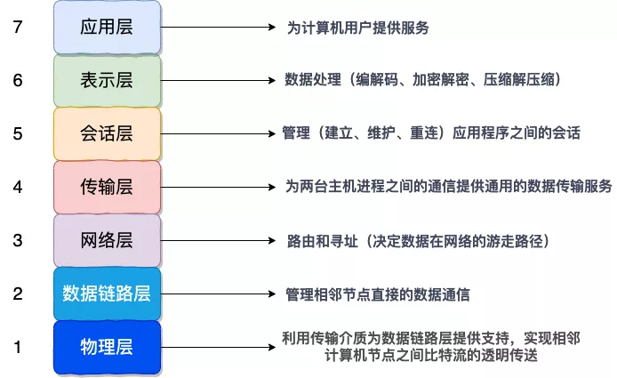
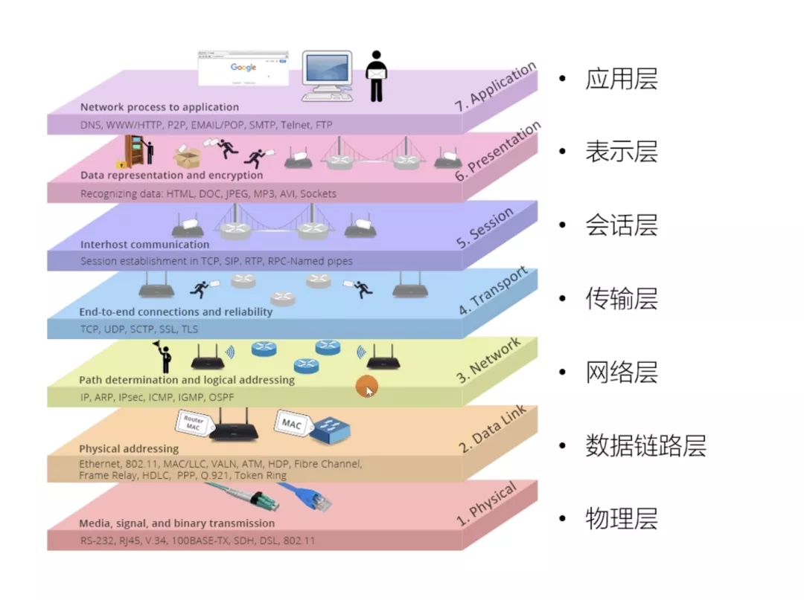
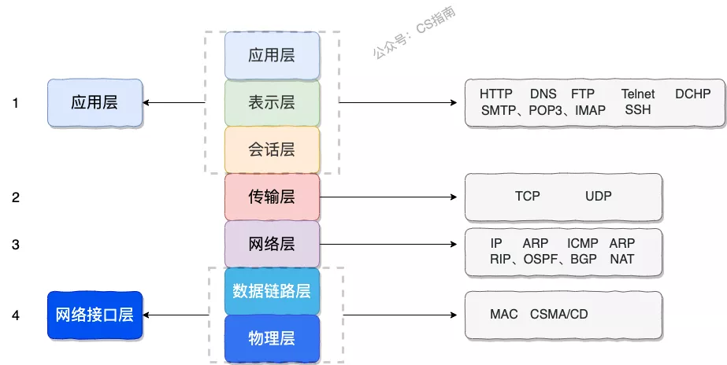
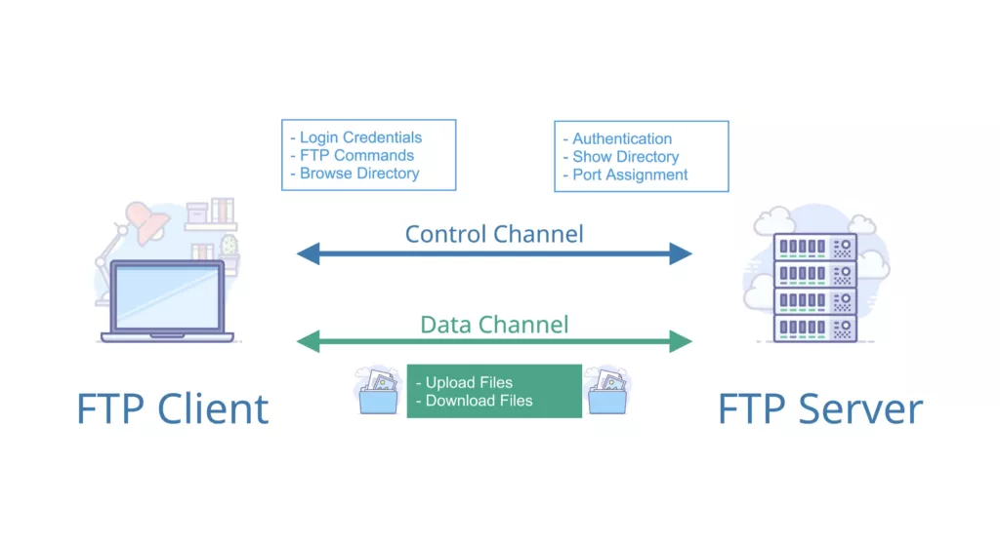
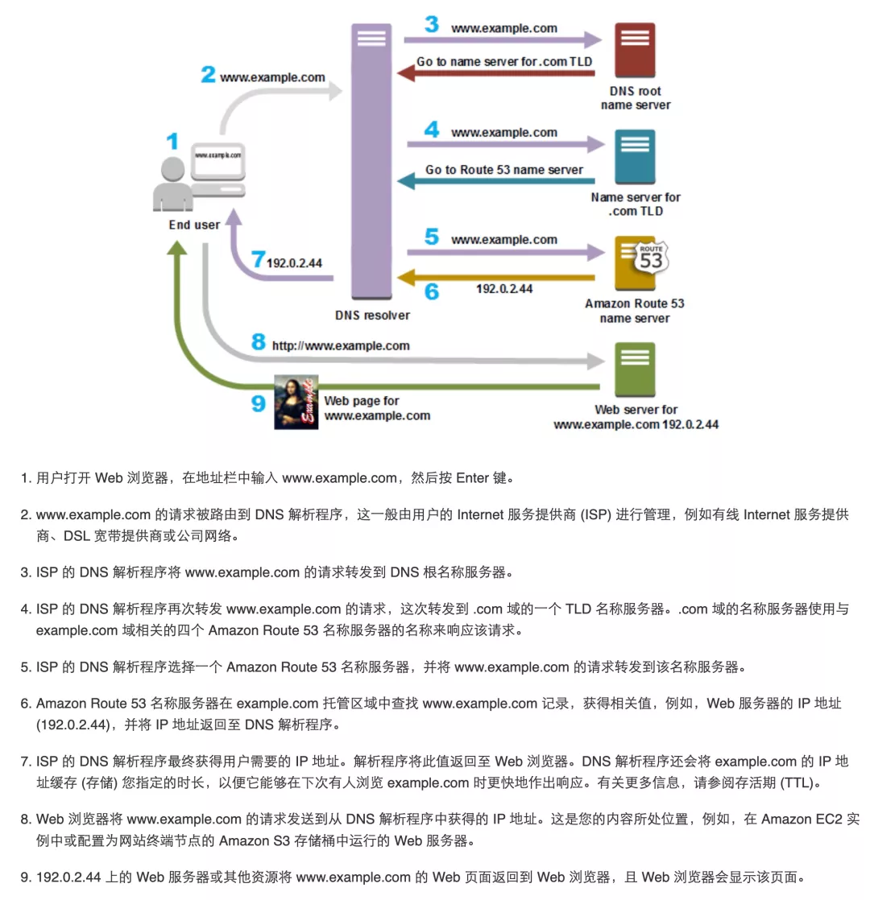
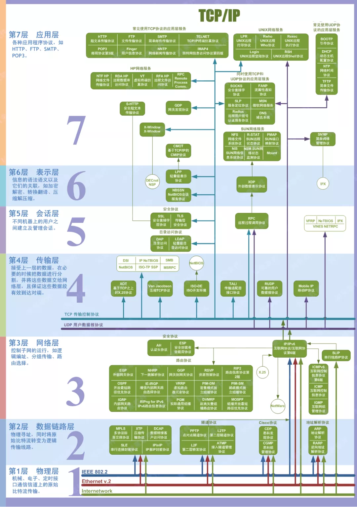

# 为什么网络要分层？每一层的职责、包含哪些协议？

这篇文章我会首先结合我们日常的软件系统开发介绍 「“为什么网络要分层”？」 ，随后我会介绍 「“OSI 7 层模型”」 以及 「“ TCP/IP 4层模型 ”」。
我会详细介绍目前广泛使用的 「“ TCP/IP 4层模型 ”」 包括每一层做的事情以及相关的协议介绍。

## 01 为什么网络要分层？

说到分层，我们先从我们平时使用框架开发一个后台程序来说，我们往往会按照每一层做不同的事情的原则将系统分为 三层（复杂的系统分层可能会更多）:

`
Repository（数据库操作）
Service（业务操作）
Controller（前后端数据交互）
`

「复杂的系统需要分层，因为每一层都需要专注于一类事情。我们的网络分层的原因也是一样，每一层只专注于做一类事情。」

「为了更好地去了解网络分层，我们先来看一个虽然失败，但是却提供了很多不错的理论基础的OSI七层模型。」

## 02 OSI七层模型

OSI七层模型的大体结构以及每一层提供的功能如下。「每一层都专注做一件事情，并且每一层都需要使用下一层提供的功能
比如传输层需要使用网络层提供的路有和寻址功能，这样传输层才知道把数据传输到哪里去。」



「OSI的七层体系结构概念清楚，理论也很完整，但是它比较复杂而且不实用，而且有些功能在多个层中重复出现。」

上面这种图可能比较抽象，再来一个比较生动的图片。下面这个图片是我在国外的一个网站上看到的，非常赞！



在这里顺带提一下：「为什么最开始的时候一直被一些大公司甚至一些国家政府支持的OSI七层模型会失败呢？」

```
1. OSI的专家缺乏实际经验，他们在完成OSI标准时缺乏商业驱动力
2. OSI的协议实现起来过分复杂，而且运行效率很低
3. OSI制定标准的周期太长，因而使得按OSI标准生产的设备无法及时进入市场（20世纪90年代初期，虽然整套的OSI国际标准都已经制定出来，但基于TCP/IP的互联网已经抢先在全球相当大的范围成功运行了）
4. OSI的层次划分不太合理，有些功能在多个层次中重复出现。
```

## 03 TCP/IP 4层模型

这是目前被广泛采用的一种模型,我们可以将 TCP / IP 模型看作是 OSI 7层模型的精简版本，由以下4层组成：

应用层
传输层
网络层
网络接口层



### 应用层协议

HTTP 协议（超文本传输协议，网页浏览常用的协议）

DHCP 协议（动态主机配置）

DNS 系统原理（域名系统）

FTP 协议（文件传输协议）

Telnet协议（远程登陆协议）

电子邮件协议等（SMTP、POP3、IMAP）

......

### 传输层协议

(1) TCP 协议

  报文段结构
  
  可靠数据传输
  
  流量控制
  
  拥塞控制

(2) UDP 协议

  报文段结构
  
  RDT（可靠数据传输协议）

### 网络层协议

IP 协议（TCP/IP 协议的基础，分为 IPv4 和 IPv6）

ARP 协议（地址解析协议，用于解析 IP 地址和 MAC 地址之间的映射）

ICMP 协议（控制报文协议，用于发送控制消息）

NAT 协议（网络地址转换协议）

RIP 协议、OSPF 协议、BGP 协议（路由选择协议）

### 网络接口层

差错检测技术

多路访问协议（信道复用技术）

CSMA/CD 协议

MAC 协议

以太网技术

#### 应用层（Application layer）

应用层的任务是通过应用进程间的交互来完成特定网络应用，我们把应用层交互的数据单元称为报文。「应用层协议定义的是应用进程（进程：主机中正在运行的程序,比如微信、QQ）间的通信和交互的规则。对于不同的网络应用需要不同的应用层协议。」 在互联网中应用层协议很多，如域名系统DNS，支持Web应用的HTTP协议，支持电子邮件的SMTP协议等等。

简单总结一下当今使用的一些最常见的应用层协议：

##### HTTP:超文本传输协议

「超文本传输协议（HTTP，HyperText Transfer Protocol)主要是为 Web 浏览器与 Web 服务器之间的通信而设计的。」

当我们使用浏览器浏览网页的时候，我们网页就是通过 HTTP 请求进行加载的

「HTTP 协议是基于 TCP协议的」，发送 HTTP 请求之前首先要建立 TCP 连接也就是要经历 3 次握手。目前使用的 HTTP 协议大部分都是 1.1。在 1.1 的协议里面，默认是开启了 Keep-Alive 的，这样的话建立的连接就可以在多次请求中被复用了。

另外， 「HTTP 协议是”无状态”的协议，它无法记录客户端用户的状态」 一般我们都是通过 Session 来记录客户端用户的状态。

##### SMTP:简单邮件传输(发送)协议

「简单邮件传输协议（SMTP，Simple Mail Transfer Protocol）的缩写，基于 TCP 协议，用来发送电子邮件。」

注意：「接受邮件的协议不是 SMTP 而是POP3协议。」

SMTP 协议这块后面不会花费太多篇幅来讲解，直接提一下两个比较重要的问题：

1. 电子邮件的发送过程

2. 如何判断邮箱是真正存在的？

电子邮件的发送过程

比如我的邮箱是“dabai@cszhinan.com”，我要向“xiaoma@qq.com”发送邮件，整个过程可以简单分为下面几步：

(1) 通过 「SMTP」 协议，我将我写好的邮件交给163邮箱服务器（邮局）。

(2) 163邮箱服务器发现我发送的邮箱是qq邮箱，然后它使用 SMTP协议将我的邮件转发到 qq邮箱服务器。

(3) qq邮箱服务器接收邮件之后就通知邮箱为“xiaoma@qq.com”的用户来收邮件，然后用户就通过 「POP3/IMAP」 协议将邮件取出。

「如何判断邮箱是真正存在的？」

很多场景(比如邮件营销)下面我们需要判断我们要发送的邮箱地址是否真的存在，这个时候我们可以利用 SMTP 协议来检测。这里就不多扯，再扯的话，估计这篇文章的内容会很多，这并不是我的一贯风格。推荐几个在线邮箱是否有效检测工具：

https://verify-email.org/

http://tool.chacuo.net/mailverify

https://www.emailcamel.com/

##### POP3/IMAP:邮件接收的协议

这两个协议不多做阐述，只需要了解 「POP3 和 IMAP 两者都是负责邮件接收的协议」即可。另外，需要注意不要将这两者和 SMTP 协议搞混淆了。「SMTP 协议只负责邮件的发送，真正负责接收的协议是POP3/IMAP。」

IMAP 协议相比于POP3更新一点，为用户提供的可选功能也更多一点,几乎所有现代电子邮件客户端和服务器都支持IMAP。大部分网络邮件服务提供商都支持POP3和IMAP。

##### FTP:文件传输协议

「文件传输协议 FTP（File Transfer Protocol），提供文件传输服务，基于 TCP 实现可靠的传输。使用 FTP 传输文件的好处是可以屏蔽操作系统和文件存储方式。」

FTP 是基于客户—服务器（C/S）模型而设计的，在客户端与 FTP 服务器之间建立两个连接。如果我们要基于 FTP 协议开发一个文件传输的软件的话，首先需要搞清楚 FTP 的原理。关于 FTP 的原理，很多书籍上已经描述的非常详细了：

```
FTP 的独特的优势同时也是与其它客户服务器程序最大的不同点就在于它在两台通信的主机之间使用了两条 TCP 连接（其它客户服务器应用程序一般只有一条 TCP 连接）：

1. 控制连接：用于传送控制信息（命令和响应）

2. 数据连接：用于数据传送；

这种将命令和数据分开传送的思想大大提高了 FTP 的效率。
```



##### DNS:域名系统

「域名系统（DNS，Domain Name System）将人类可读的域名 (例如，www.baidu.com) 转换为机器可读的 IP 地址 (例如，220.181.38.148)。」 我们可以将其理解为专为互联网设计的电话薄。


IP 地址是一个网卡再网络世界中的通讯地址，我们可以把它理解为我们现实世界中的家庭地址。

「DNS 解析的完整流程是怎样的呢？」



##### Telnet:远程登陆协议

远程登陆协议，通过一个终端登陆到其他服务器，建立在可靠的传输协议 TCP 之上。

「Telnet协议的最大缺点之一是所有数据（包括用户名和密码）均以明文形式发送，这有潜在的安全风险。这就是为什么如今很少使用Telnet并被一种称为SSH的非常安全的协议所取代的主要原因。」

##### SSH:安全的网络传输协议

SSH（ Secure Shell）是目前较可靠，专为远程登录会话和其他网络服务提供安全性的协议。利用 SSH 协议可以有效防止远程管理过程中的信息泄露问题。SSH 建立在可靠的传输协议 TCP 之上。

「Telnet 和 SSH 之间的主要区别在于 SSH 协议会对传输的数据进行加密保证数据安全性。」

#### 传输层（Transport layer）

「传输层的主要任务就是负责向两台主机进程之间的通信提供通用的数据传输服务」。应用进程利用该服务传送应用层报文。“通用的”是指并不针对某一个特定的网络应用，而是多种应用可以使用同一个运输层服务。

「运输层主要使用以下两种协议：」

「传输控制协议TCP」（Transmisson Control Protocol）--提供「面向连接」的，「可靠的」数据传输服务。

「用户数据协议UDP」（User Datagram Protocol）--提供「无连接」的，尽最大努力的数据传输服务（「不保证数据传输的可靠性」）。

关于 TCP 和 UDP 的详细介绍会在后面的文章中介绍到。

#### 网络层（Network layer）

网络层负责为分组交换网上的不同主机提供通信服务。在发送数据时，网络层把运输层产生的报文段或用户数据报封装成分组和包进行传送。在TCP/IP体系结构中，由于网络层使用IP协议，因此分组也叫IP数据报，简称数据报。

注意：「不要把运输层的“用户数据报UDP”和网络层的“IP数据报”弄混」。

「网络层的还有一个任务就是选择合适的路由，使源主机运输层所传下来的分株，能通过网络层中的路由器找到目的主机。」

这里强调指出，网络层中的“网络”二字已经不是我们通常谈到的具体网络，而是指计算机网络体系结构模型中第三层的名称.

互联网是由大量的异构（heterogeneous）网络通过路由器（router）相互连接起来的。互联网使用的网络层协议是无连接的网际协议（Intert Prococol）和许多路由选择协议，因此互联网的网络层也叫做「网际层」或「IP层」。

#### 网络接口层

我们可以把网络接口层看作是数据链路层和物理层的合体。

1. 数据链路层(data link layer)通常简称为链路层（ 两台主机之间的数据传输，总是在一段一段的链路上传送的）。「数据链路层的作用是将网络层交下来的 IP 数据报组装成帧，在两个相邻节点间的链路上传送帧。每一帧包括数据和必要的控制信息（如同步信息，地址信息，差错控制等）。」

2.「物理层的作用是实现相邻计算机节点之间比特流的透明传送，尽可能屏蔽掉具体传输介质和物理设备的差异」


# 总结

如何理解网络协议：
协议，网络协议的简称，网络协议使通信计算机双方必须遵从的一组约定，如怎么样建立连接，怎么样相互识别等。最有遵守这个约定，计算机之间才能相互通信交流
为了使数据在网络上从源到达目的地，网络通信的参与方必须遵循相同的规则，这套规则称为协议（protocol），**它最终体现为在网络上传输的数据包格式**。
这句话非常重要，结合 [输入 xxxhub 的背后到底发生了什么.md] 会容易"它最终体现为在网络上传输的数据包格式".
协议往往分成几个层次进行定义，分层定义是为了使某一层协议的改变不影响其他层次的协议。这句话也非常关键。


