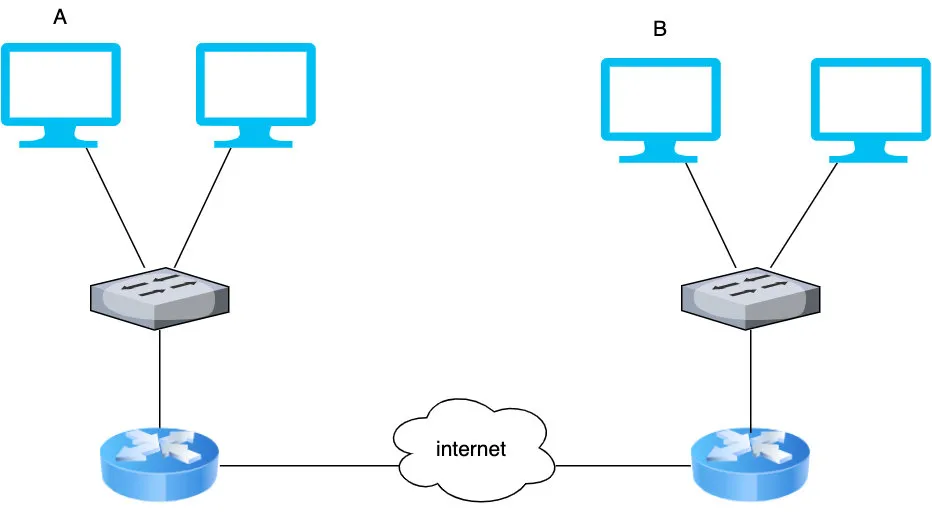
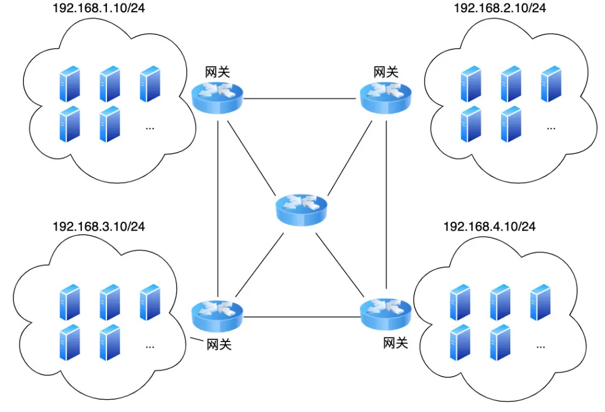
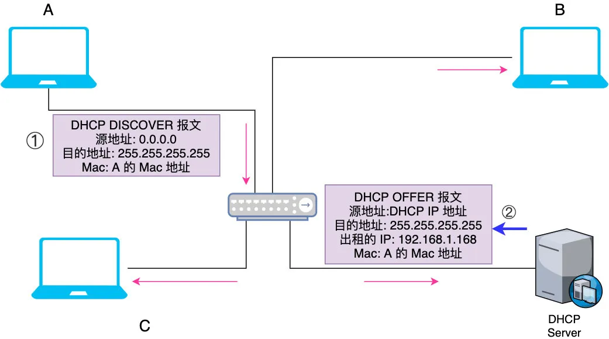
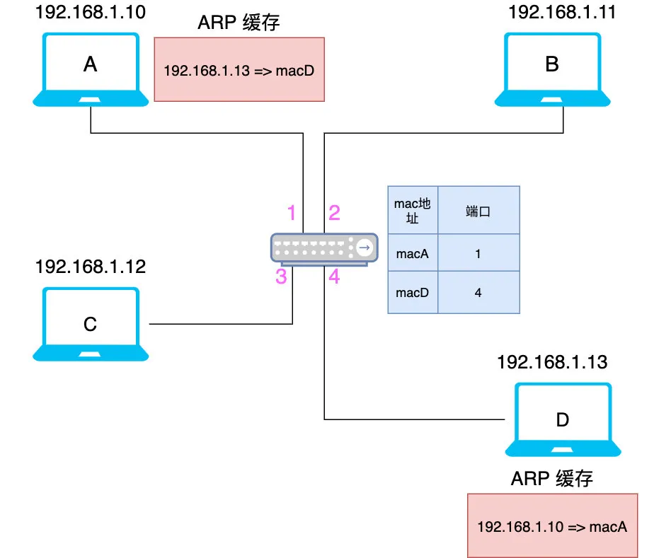
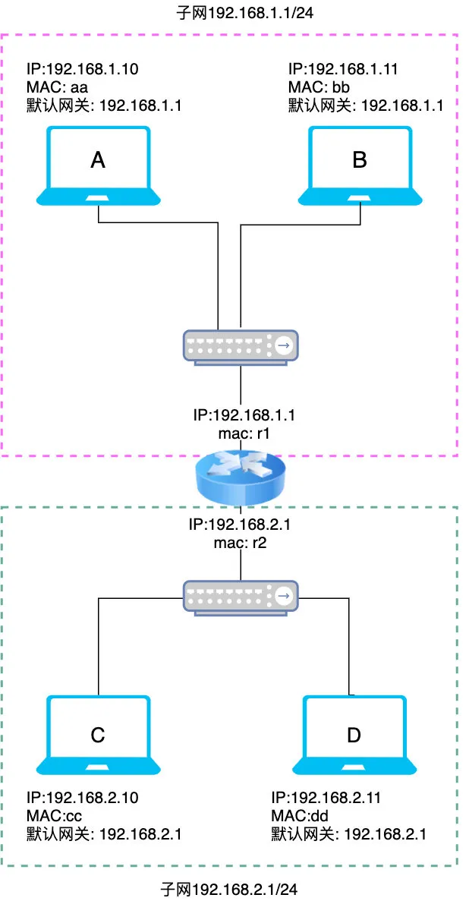

# 输入 xxxhub 的背后到底发生了什么

今天我们来深度剖析一个老生常谈的话题「请说出在淘宝网输入一个商品到最终展示的完整路径」，
这题很难，涉及到网络的工作机制，硬件上需要对交换机，路由器，网卡的工作机制有所了解，软件上则涉及到 TCP，LVS 的工作原理.

接下来我们会深度剖析下图中 A 与 B 的通信流程，坐稳了，发车！



# 借用生活场景来理解网络中的概念

## 以学校老师点名学生为例讲解网络的基本原理

很多技术术语我们可能理解得很费劲，但是往往引入生活学习场景会一目了然，很多技术的设计思路就取自生活中的点点滴滴，接下来我们就以学校的场景为例来一步步理解网络的设计思路。
学军小学开学了，第一天一年级一班的同学都到齐了，新来的老师并不认识其中的每一个人，但是没关系，他有一份学生名单
现在老师想认识班上叫「李四」的同学，于是他先在在班上大喊了一声「李四」，虽然所有人都听到了老师的声音，但由于喊的是李四，所以其他人不作声，只有李四回了一声「到」

## 总结

1.主机：即学生
2.子网: 班级就对应互联网中的子网，互联网就是由无数的子网组成的，要与计算机通信，必须先找到计算机所在子网
3.网络地址：「学军小学一年级一班」即班级编号就相当于网络地址，相当于子网的编号，主要用来判断主机是否在同一个子网
4.主机地址：张三，李四就相当于主机地址，相当于确定了班级后，可以分配学生了
5.IP 地址: 「学军小学一年级一班张三」即 IP 地址，相当于计算机的编号，不难发现 IP 地址由网络地址+主机地址组成，只不过主机中的 IP 地址由 32 位的二进制数也就是 4 个字节组成，IP地址通常用点分十进制表示成（a.b.c.d）的形式，如 192.168.1.10，
6.子网掩码: IP 地址虽然包含了网络地址，比如 IP「学军小学一年级一班李四」的网络地址为「学军小学一年级一班」，但是只有 IP 是无法知道网络地址的，必须指定哪几位为网络地址，在此例中我指定前 9（学军小学一年级一班的长度） 个字为网络地址，我们可以写成 学军小学一年级一班李四/9，代表此 IP 的前 9 位为 网络地址， 在计算机中我们则用 192.168.1.10/24 这样的形式来表示，这种用来指明一个 IP 地址的哪些位标识的是主机所在的子网的形式我们称为子网掩码
7.mac 地址:「学生的容貌+身份证」就相当于计算机 mac 地址，即网卡地址，每个网卡地址在全球都是独一无二的，mac 地址有48位，通常表示为12个16进制数，每两个16进制数之间用冒号分隔开，如【08:00:20:0A:8C:6D】，一旦找到子网，就可以先根据 IP 找到 mac，再根据 mac 找到对应的计算机，一般一个 mac 对应一个 IP（一位学生为其分配一个班级学号）
8.网关:两名学生如果不在同一个班级（不在同一个子网），则需要出门寻找，这里的门就相当于网关

## 注意
学生要能被叫到，必须要先入学报名然后学校根据其「容貌+身份证」（mac地址）分配到某个班级（比如学军小学一年级一班张三，对应 IP 地址）,
也就是说计算机如果要能通信必须首先被分配某个子网的一个 IP，原因也不难理解，学生都不在班级里（没有编号），老师同学无论在哪个班级喊你都听不到，至此可以得出网络的基本架构如下



# 计算机是如何通信的

经过上一小节分析你会发现计算机要通信无非分两种情况

> 1.同一个子网中的两台计算机通信（在一个班级）

> 2.不属于同一个子网两台计算机的通信（不在一个班级）

## 两台计算机属于同一个子网

人与人是可以靠声音通信，但计算机必须通过网线相连才能通信，不过计算机一般只有一个网卡接口，只能连一根网线，但一个子网里可能有几百台机器，它们之间该怎么连线呢
计算机中有一句经典名言：没有什么是加一层解决不了的问题，如果有那就再加一层，所以我们可以加个中间层，让其它电脑连到这个中间层，然后让这个中间层再转发

### IP 的诞生

上一节中我们提到，计算机要通信必须首先被分配一个子网中的 IP，你可以为每台机器手动指定（静态 IP），但手动配置确实太麻烦了，
所以一般通过 DHCP 服务器来动态分配 IP 地址，比如现在 A 是刚接入此子网的计算机，它没有 IP，所以它会发一个包含有 A 机 mac 地址的广播包，
由于是广播包，每台机器都能收到，但只有 DHCP 才能做出响应，DHCP 会给这台机器发一个带有 IP 地址的响应包



如图示获取 IP 的步骤如下

1.首先 A 发出一个 DHCP DISCOVRE 广播包，由于它还没有 IP，所以源地址设为 0.0.0.0，它刚接入也不知道 DHCP IP 是啥，所以设置为 255.255.255.255（受限的广播地址，只会在子网中进行广播的），所有机器都会收到，但只有 DHCP server 能响应
2.DHCP server 会发出一个「分配的 IP」,「A 的 mac地址」等的广播包，所有机器都能收到，收到后机器会拿到报文里的 mac 地址和自己的比对一下，如果是会再向 DHCP 发送一个确认使用此 IP 的广播包，DHCP 收到此包后记录此 IP 已被使用，同时再次发出一个 DHCP ACK 确认此 IP 可用，于是 A 就有了 IP
就这样每台机器接入子网后通过 DHCP 都获取到了自己的 IP 地址.好了，既然每台机器都被分配了 IP， MAC 地址也知道了（网卡自带的），那么两台机器该怎么通信呢？

我们来看下已知 D 的 IP，A 该怎么和 D 通信，首先 A 要判断 D 是不是在同一个子网，怎么判断呢，上一节我们提到过，**子网掩码**，一般在组网的时候我们会指定哪几位为网络地址，哪几位为主机地址，**只要网络地址相同就可以认为是在同一个子网**

```
IP 地址有 32 位，如果我们指定前 24 为网络地址，那么后 8 位就是主机地址，那么已经一个 IP 是 192.168.1.10 该怎么算它的网络地址呢
```

前 24 位为网络地址，则说明前 24 位需要保留，剩下的 8 位地址不保留（为 0），那么只需要让此 IP 与 前 24 为 1，后 8 位为 0 的数字（十进制表示为 255.255.255.0）相与即可获取网络地址，即为 11000000.11000000.00000001.00000000，换算成十进制即为 192.168.1.0
由于前 24 位是网络号，所以 A（192.168.1.10/24）和 D（192.168.1.13/24）的网络地址是一样的（都是192.168.1.0），代表它们是同一个子网

### ARP

既然是同一个子网那 A 要找 D 就好办了，一开始 A 知道 D 的 IP，但还没法和具体哪台机器对上号，就像新开学班主任拿着学生名单却没法对上具体哪个学生一样，于是 A 在子网里发了一个广播包大吼一声：IP 地址为 192.168.1.13 的机器是谁啊
由于是一个广播包，所以 B，C，D 都收到了此广播包，拿到包之后对比一下 IP 发现只有 D 能对上，于是 B，C 不响应，D 回复了一句，是我，同时把自己的 IP ，mac 地址发出去，于是 A 收到了 D 的 MAC，在自己的机器中更新「192.168.1.13」对应的 Mac 地址为 macD(d的 mac 地址)，
注意在此过程 A 的广播包中包含 A 的 ip 和 mac，所以 D 收到此广播包后也会在本地更新「192.168.1.10」对应的 Mac 地址为 macA，我们把这个过程称为 ARP(Address Resolution Protocol)，即根据 IP 获取 mac 地址的一个协议。

另外在此过程中，如果中间设备是交换机，它也注意到 A 经过 1 口，交换机会记录 1 口连着 A（用 A 的 mac 地址表示），同时当 D 响应时会把包发给 4 口，交换机也会记录 4 口连着 D，于是经过此次 ARP， A，D，交换机中的记录如下



交换机就是通过 ARP 不断把机器与其所连端口记录更新在表中

当 A 再次给 D 发送数据时就好办了，此时数据包会带上 A 的 IP，A 的 mac，D 的 ip 与 D 的 mac(源 MAC,目标 MAC,源 ip， 目标 ip)

交换机收到数据包后一看目标 mac 是 D 的 mac 地址 macD，查找了一下它的记录表，macD 应该从端口 4 出去，于是直接把包转发给了 D，不需要全局广播了，从这里也可以看出为啥说交换机是二层的（数据链接层，有 mac 地址），因为它记录了 mac 地址和端口的关系，不涉及到 IP。

同一个子网两台计算机的请求大家应该明白了，接下来再来看看不在同一个子网的两台计算机是如何通信的。

## 两台计算机不属于同一个子网

这种情况下就像两个不同班级的学生要通信，首先必须要出门，找到对方的班级，然后再找到本人，这个门在网络中我们称为默认网关（gateway），
一般由路由器来充当网关的角色，网关地址是子网的第一个主机地址，假设网络地址为 192.168.1.0/24，则默认网关 IP 为 192.168.1.1，
子网中的每台主机都会有一个默认网关



现在我们再来看下 A 如何与 D 通信

1. 首先计算下 D 是否与 A 同在同一个子网，A 所在子网为 192.168.1.1/24，即它的网络地址为 192.168.1.0，子网掩码为 255.255.255.0，
将 A 的子网掩码与 D 的 IP 地址 192.168.2.11 相与得到 192.168.2.0，说明 A 与 D 不在同一个子网

2. 于是 A 要把包发到网关，即 192.168.1.1，一开始 A 也不知道网关的 mac 地址，于是 A 首先发了个 ARP 包获取网关的 mac 地址，然后将以下包发给网关
源Mac:aa   源IP:192.168.1.10
目标Mac:r1  目标IP:192.168.2.11

这里千万要注意：目标 Mac 是网关的 mac，但目标 IP 是 D 的 IP ，并不是网关的 IP！原因也不难理解，你送个快递只会在多个中转站（mac 地址）间流转，目标地址肯定不能变

3. 路由器收到上面这个包后会取出它的目标 IP，然后查一下路由表

目的地址	      子网掩码		      端口
192.168.1.1	  255.255.255.0   0
192.168.2.1	  255.255.255.0   1
192.168.2.3	  255.255.255.0   2

路由表的每一项由「目的地址」，「子网掩码」,「下一跳」,「端口」这四项组成，
目的地址和子网掩码可以算出网络地址，以第二项为例，它表示的意思是所有目标 IP 的网络地址为 192.168.2.1 & 255.255.255.0 = 192.168.2.0 的都走端口 1

目标 IP 会与每一项都匹配，匹配到哪一项路由器就把包从对应的端口转发出去

由于此时目标 IP 是 192.168.2.11， 将其与第二条的子网掩码（255.255.255.0）相与后为 192.168.2.0，说明与第二条匹配，于是就把包从端口 2 转发出去了，但此时路由器也不知道 目标 IP: 192.168.2.11 的 mac 地址，
于是它也用 ARP 先获得此 IP 对应的 mac 地址，然后再将数据包的目标 mac 地址改为 D 的 mac 地址发送出去，注意此时的源 mac 地址也要修改为路由器端口对应的 mac

源Mac:r2   源IP:192.168.1.10
目标Mac:dd  目标IP:192.168.2.11

可以看到在转发过程中源 IP，目标 IP 不会变，而源 mac和目标 mac 地址会不断变化

4. 交换机再将上述的包转发给 D 即可

至此相信你明白了路由器为啥属于三层设备，三层是网络层，负责根据 IP 寻址，
另外相信大家不难想到路由器的一个端口就是一个广播域，同一台路由器不同端口对应的网段（网络地址）是不同的

路由器之间是怎么通信的

上面说的是在同一个路由器不同端口对应的子网上的机器互相连通的问题，接下来我们来看看如果一个网络有多台路由器相连的话主机之间是怎么通信的


