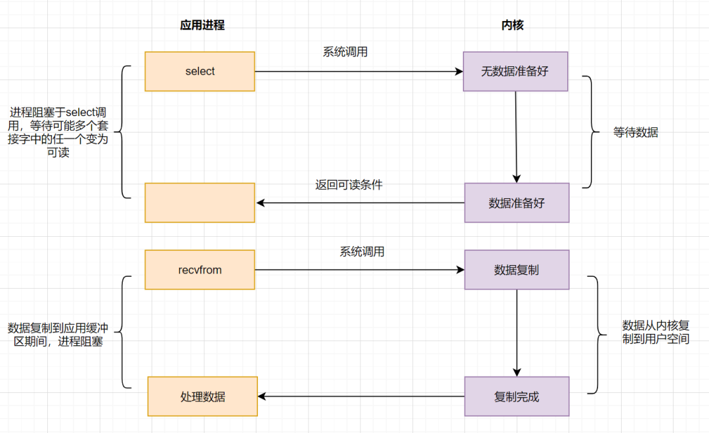

# 操作系统的一次IO过程

1. 应用程序发起的一次IO操作包含两个阶段：

(1). IO调用：应用程序进程向操作系统内核发起调用。
(2). IO执行：操作系统内核完成IO操作。

2. 操作系统内核完成IO操作还包括两个过程：

(1). 准备数据阶段：内核等待I/O设备准备好数据
(2). 拷贝数据阶段：将数据从内核缓冲区拷贝到用户进程缓冲区


## 阻塞IO模型

假设应用程序的进程发起IO调用，但是如果内核的数据还没准备好的话，那应用程序进程就一直在阻塞等待，一直等到内核数据准备好了，从内核拷贝到用户空间，才返回成功提示，此次IO操作，称之为阻塞IO。


**阻塞IO比较经典的应用就是阻塞socket、Java BIO。**

阻塞IO的缺点就是：如果内核数据一直没准备好，那用户进程将一直阻塞，浪费性能，可以使用非阻塞IO优化。

## 非阻塞IO模型

如果内核数据还没准备好，可以先返回错误信息给用户进程，让它不需要等待，而是通过轮询的方式再来请求。这就是非阻塞IO，流程图如下：


非阻塞IO的流程如下：

```
应用进程向操作系统内核，发起recvfrom读取数据。
操作系统内核数据没有准备好，立即返回EWOULDBLOCK错误码。
应用程序进程轮询调用，继续向操作系统内核发起recvfrom读取数据。
操作系统内核数据准备好了，从内核缓冲区拷贝到用户空间。
完成调用，返回成功提示。
```

**非阻塞IO模型，简称NIO，Non-Blocking IO。**
它相对于阻塞IO，虽然大幅提升了性能，但是它依然存在性能问题，即频繁的轮询，导致频繁的系统调用，同样会消耗大量的CPU资源。
可以考虑IO复用模型，去解决这个问题。

## IO多路复用模型

既然NIO无效的轮询会导致CPU资源消耗，我们等到内核数据准备好了，主动通知应用进程再去进行系统调用，那不就好了嘛？

在这之前，我们先来复习下，什么是文件描述符fd(File Descriptor),它是计算机科学中的一个术语，形式上是一个非负整数。当程序打开一个现有文件或者创建一个新文件时，内核向进程返回一个文件描述符。

IO复用模型核心思路：系统给我们提供一类函数（如我们耳濡目染的select、poll、epoll函数），它们可以同时监控多个fd的操作，任何一个返回内核数据就绪，应用进程再发起recvfrom系统调用。

### IO多路复用之select

应用进程通过调用select函数，可以同时监控多个fd，在select函数监控的fd中，只要有任何一个数据状态准备就绪了，select函数就会返回可读状态，这时应用进程再发起recvfrom请求去读取数据。



非阻塞IO模型（NIO）中，需要N（N>=1）次轮询系统调用，然而借助select的IO多路复用模型，只需要发起一次询问就够了,大大优化了性能。

但是呢，select有几个缺点：

```
监听的IO最大连接数有限，在Linux系统上一般为1024。
select函数返回后，是通过遍历fdset，找到就绪的描述符fd。（仅知道有I/O事件发生，却不知是哪几个流，所以遍历所有流）
```

因为存在连接数限制，所以后来又提出了poll。与select相比，poll解决了连接数限制问题。但是呢，select和poll一样，还是需要通过遍历文件描述符来获取已经就绪的socket。如果同时连接的大量客户端，在一时刻可能只有极少处于就绪状态，伴随着监视的描述符数量的增长，效率也会线性下降。

因此经典的多路复用模型epoll诞生。

### IO多路复用之epoll

为了解决select/poll存在的问题，多路复用模型epoll诞生，它采用事件驱动来实现，流程图如下：


epoll先通过epoll_ctl()来注册一个fd（文件描述符），一旦基于某个fd就绪时，内核会采用回调机制，迅速激活这个fd，当进程调用epoll_wait()时便得到通知。这里去掉了遍历文件描述符的坑爹操作，而是采用监听事件回调的机制。这就是epoll的亮点。

我们一起来总结一下select、poll、epoll的区别


                select	                poll	                      epoll
底层数据结构	    数组	                    链表	                        红黑树和双链表
获取就绪的fd	    遍历	                    遍历	                        事件回调
事件复杂度	      O(n)	                  O(n)	                      O(1)
最大连接数	      1024	                  无限制	                      无限制
fd数据拷贝	      每次调用select，          每次调用poll，                使用内存映射(mmap)，
                需要将fd数据从用户空间      需要将fd数据从用户             不需要从用户空间
                拷贝到内核空间		          空间拷贝到内核空间              频繁拷贝fd数据到内核空间

epoll明显优化了IO的执行效率，但在进程调用epoll_wait()时，仍然可能被阻塞。
能不能酱紫：不用我老是去问你数据是否准备就绪，等我发出请求后，你数据准备好了通知我就行了，这就诞生了信号驱动IO模型。

## IO模型之信号驱动模型

信号驱动IO不再用主动询问的方式去确认数据是否就绪，而是向内核发送一个信号（调用sigaction的时候建立一个SIGIO的信号），然后应用用户进程可以去做别的事，不用阻塞。
当内核数据准备好后，再通过SIGIO信号通知应用进程，数据准备好后的可读状态。应用用户进程收到信号之后，立即调用recvfrom，去读取数据。


信号驱动IO模型，在应用进程发出信号后，是立即返回的，不会阻塞进程。它已经有异步操作的感觉了。
但是你细看上面的流程图，发现数据复制到应用缓冲的时候，应用进程还是阻塞的。回过头来看下，不管是BIO，还是NIO，还是信号驱动，在数据从内核复制到应用缓冲的时候，都是阻塞的。还有没有优化方案呢？AIO（真正的异步IO）！

## IO 模型之异步IO(AIO)

前面讲的BIO，NIO和信号驱动，在数据从内核复制到应用缓冲的时候，都是阻塞的，因此都不算是真正的异步。AIO实现了IO全流程的非阻塞，就是应用进程发出系统调用后，是立即返回的，但是立即返回的不是处理结果，而是表示提交成功类似的意思。等内核数据准备好，将数据拷贝到用户进程缓冲区，发送信号通知用户进程IO操作执行完毕。

流程如下：


异步IO的优化思路很简单，只需要向内核发送一次请求，就可以完成数据状态询问和数据拷贝的所有操作，并且不用阻塞等待结果。日常开发中，有类似思想的业务场景：

```
比如发起一笔批量转账，但是批量转账处理比较耗时，这时候后端可以先告知前端转账提交成功，等到结果处理完，再通知前端结果即可。
```

## 阻塞、非阻塞、同步、异步IO划分


IO模型

阻塞I/O模型	          同步阻塞
非阻塞I/O模型	        同步非阻塞
I/O多路复用模型	      同步阻塞
信号驱动I/O模型	      同步非阻塞
异步IO（AIO）模型	    异步非阻塞

## 一个通俗例子读懂BIO、NIO、AIO

同步阻塞(blocking-IO)简称BIO

同步非阻塞(non-blocking-IO)简称NIO

异步非阻塞(asynchronous-non-blocking-IO)简称AIO

一个经典生活的例子：

小明去吃同仁四季的椰子鸡，就这样在那里排队，等了一小时，然后才开始吃火锅。(BIO)
小红也去同仁四季的椰子鸡，她一看要等挺久的，于是去逛会商场，每次逛一下，就跑回来看看，是不是轮到她了。于是最后她既购了物，又吃上椰子鸡了。（NIO）
小华一样，去吃椰子鸡，由于他是高级会员，所以店长说，你去商场随便逛会吧，等下有位置，我立马打电话给你。于是小华不用干巴巴坐着等，也不用每过一会儿就跑回来看有没有等到，最后也吃上了美味的椰子鸡（AIO）


