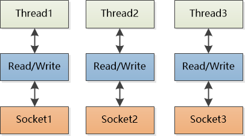
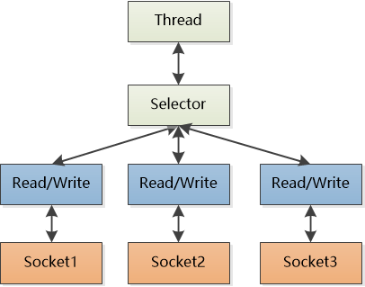

# Netty有什么用

## 例一

随着移动互联网的爆发性增长，小明公司的电子商务系统访问量越来越大，由于现有系统是个单体的巨型应用，已经无法满足海量的并发请求，拆分势在必行。
在微服务的大潮之中， 架构师小明把系统拆分成了多个服务，根据需要部署在多个机器上，这些服务非常灵活，可以随着访问量弹性扩展。
世界上没有免费的午餐， 拆分成多个“微服务”以后虽然增加了弹性，但也带来了一个巨大的挑战：服务之间互相调用的开销。
比如说：原来用户下一个订单需要登录，浏览产品详情，加入购物车，支付，扣库存等一系列操作，在单体应用的时候它们都在一台机器的同一个进程中，说白了就是模块之间的函数调用，效率超级高。 
现在好了，服务被安置到了不同的服务器上，一个订单流程，几乎每个操作都要越网络，都是远程过程调用(RPC)， 那执行时间、执行效率可远远比不上以前了。
远程过程调用的第一版实现使用了HTTP协议，也就是说各个服务对外提供HTTP接口。 小明发现，HTTP协议虽然简单明了，但是废话太多，仅仅是给服务器发个简单的消息都会附带一大堆无用信息：
```
GET /orders/1 HTTP/1.1                                                                                             

Host: order.myshop.com

User-Agent: Mozilla/5.0 (Windows NT 6.1; )

Accept: text/html;

Accept-Language: en-US,en;

Accept-Encoding: gzip

Connection: keep-alive
......
```

看看那User-Agent，Accept-Language ，这个协议明显是为浏览器而生的！但是我这里是程序之间的调用，用这个HTTP有点亏。

能不能自定义一个精简的协议？ 在这个协议中我只需要把要调用方法名和参数发给服务器即可，根本不用这么多乱七八糟的额外信息。

但是自定义协议客户端和服务器端就得直接使用“低级”的Socket了，尤其是服务器端，得能够处理高并发的访问请求才行。 

小明复习了一下服务器端的socket编程，最早的Java是所谓的阻塞IO(Blocking IO)， 想处理多个socket的连接的话需要创建多个线程， 一个线程对应一个。



这种方式写起来倒是挺简单的，但是连接（socket）多了就受不了了，如果真的有成千上万个线程同时处理成千上万个socket，占用大量的空间不说，光是线程之间的切换就是一个巨大的开销。

更重要的是，虽然有大量的socket，但是真正需要处理的（可以读写数据的socket）却不多，大量的线程处于等待数据状态（这也是为什么叫做阻塞的原因），资源浪费得让人心疼。

后来Java为了解决这个问题，又搞了一个非阻塞IO(NIO：Non-Blocking IO，有人也叫做New IO)， 改变了一下思路：通过多路复用的方式让一个线程去处理多个Socket。



这样一来，只需要使用少量的线程就可以搞定多个socket了，线程只需要通过Selector去查一下它所管理的socket集合，哪个Socket的数据准备好了，就去处理哪个Socket，一点儿都不浪费。

好了，就是Java NIO了！

小明先定义了一套精简的RPC的协议，里边规定了如何去调用一个服务，方法名和参数该如何传递，返回值用什么格式......等等。然后雄心勃勃地要把这个协议用Java NIO给实现了。

可是美好的理想很快被无情的现实给击碎， 小明努力了一周就意识到自己陷入了一个大坑之中，Java NIO虽然看起来简单，但是API还是太“低级”了，有太多的复杂性，没有强悍的、一流的编程能力根本无法驾驭，根本做不到高并发情况下的可靠和高效。

后来小明发现了 Netty 这个开源框架，它可以快速地开发高性能的面向协议的服务器和客户端。 易用、健壮、安全、高效，你可以在Netty上轻松实现各种自定义的协议！

说说 Netty 到底是何方神圣， 要解决什么问题吧。

像上面小明的例子，想使用 Java NIO 来实现一个高性能的RPC框架，调用协议，数据的格式和次序都是自己定义的，现有的HTTP根本玩不转，那使用Netty就是绝佳的选择。

其实游戏领域是个更好的例子，长连接，自定义协议，高并发，Netty 就是绝配。

因为 Netty 本身就是一个基于 NIO 的网络框架， 封装了 Java NIO 那些复杂的底层细节，给你提供简单好用的抽象概念来编程。

注意几个关键词，首先它是个框架，是个“半成品”，不能开箱即用，你必须得拿过来做点定制，利用它开发出自己的应用程序，然后才能运行（就像使用Spring那样）。 

一个更加知名的例子就是阿里巴巴的 Dubbo 了，这个 RPC 框架的底层用的就是 Netty。 

另外一个关键词是高性能，如果你的应用根本没有高并发的压力，那就不一定要用 Netty 了。

## 例二

作为一个学Java的，如果没有研究过Netty，那么你对Java语言的使用和理解仅仅停留在表面水平，会点SSH，写几个MVC，访问数据库和缓存，
这些只是初等Java程序员干的事。如果你要进阶，想了解Java服务器的深层高阶知识，Netty绝对是一个必须要过的门槛。
有了Netty，你可以实现自己的HTTP服务器，FTP服务器，UDP服务器，RPC服务器，WebSocket服务器，Redis的Proxy服务器，MySQL的Proxy服务器等等。
如果你想知道Nginx是怎么写出来的，如果你想知道Tomcat和Jetty是如何实现的，如果你也想实现一个简单的Redis服务器，那都应该好好理解一下Netty，它们高性能的原理都是类似的。

我们回顾一下传统的HTTP服务器的原理
> 1. 创建一个ServerSocket，监听并绑定一个端口
> 2. 一系列客户端来请求这个端口
> 3. 服务器使用Accept，获得一个来自客户端的Socket连接对象
> 4. 启动一个新线程处理连接
>（1）读Socket，得到字节流
>（2）解码协议，得到Http请求对象
>（3）处理Http请求，得到一个结果，封装成一个HttpResponse对象
>（4）编码协议，将结果序列化字节流
>（5）写Socket，将字节流发给客户端
> 5. 继续循环步骤3

HTTP服务器之所以称为HTTP服务器，是因为编码解码协议是HTTP协议，如果协议是Redis协议，那它就成了Redis服务器，如果协议是WebSocket，那它就成了WebSocket服务器，等等。

使用Netty你就可以定制编解码协议，实现自己的特定协议的服务器。

上面我们说的是一个传统的多线程服务器，这个也是Apache处理请求的模式。在高并发环境下，线程数量可能会创建太多，操作系统的任务调度压力大，系统负载也会比较高。那怎么办呢？

于是NIO诞生了，NIO并不是Java独有的概念，NIO代表的一个词汇叫着IO多路复用。
它是由操作系统提供的系统调用，早期这个操作系统调用的名字是select，但是性能低下，后来渐渐演化成了Linux下的epoll和Mac里的kqueue。
我们一般就说是epoll，因为没有人拿苹果电脑作为服务器使用对外提供服务。而Netty就是基于Java NIO技术封装的一套框架。
为什么要封装，因为原生的Java NIO使用起来没那么方便，而且还有臭名昭著的bug，Netty把它封装之后，提供了一个易于操作的使用模式和接口，用户使用起来也就便捷多了。

那NIO究竟是什么东西呢？

NIO的全称是NoneBlocking IO，非阻塞IO，区别与BIO，BIO的全称是Blocking IO，阻塞IO。那这个阻塞是什么意思呢？

```
1. Accept是阻塞的，只有新连接来了，Accept才会返回，主线程才能继
2. Read是阻塞的，只有请求消息来了，Read才能返回，子线程才能继续处理
3. Write是阻塞的，只有客户端把消息收了，Write才能返回，子线程才能继续读取下一个请求
```

所以传统的多线程服务器是BlockingIO模式的，从头到尾所有的线程都是阻塞的。这些线程就干等在哪里，占用了操作系统的调度资源，什么事也不干，是浪费。

那么NIO是怎么做到非阻塞的呢。它用的是**事件机制**。它可以用一个线程把Accept，读写操作，请求处理的逻辑全干了。如果什么事都没得做，它也不会死循环，它会将线程休眠起来，直到下一个事件来了再继续干活，这样的一个线程称之为NIO线程。

Netty是建立在NIO基础之上，Netty在NIO之上又提供了更高层次的抽象。

在Netty里面，Accept连接可以使用单独的线程池去处理，读写操作又是另外的线程池来处理。Accept连接和读写操作也可以使用同一个线程池来进行处理。
而请求处理逻辑既可以使用单独的线程池进行处理，也可以跟放在读写线程一块处理。线程池中的每一个线程都是NIO线程。
用户可以根据实际情况进行组装，构造出满足系统需求的并发模型。

Netty提供了内置的常用编解码器，包括行编解码器［一行一个请求］，前缀长度编解码器［前N个字节定义请求的字节长度］，
可重放解码器［记录半包消息的状态］，HTTP编解码器，WebSocket **消息编解码器**等等

Netty提供了一些列生命周期回调接口，当一个完整的请求到达时，当一个连接关闭时，当一个连接建立时，用户都会收到回调事件，然后进行逻辑处理。

Netty可以同时管理多个端口，可以使用NIO客户端模型，这些对于RPC服务是很有必要的。

Netty除了可以处理TCP Socket之外，还可以处理UDP Socket。

在消息读写过程中，需要大量使用ByteBuffer，Netty对ByteBuffer在性能和使用的便捷性上都进行了优化和抽象。

总之，Netty是Java程序员进阶的必备神奇。如果你知其然，还想知其所以然，一定要好好研究下Netty。如果你觉得Java枯燥无谓，Netty则是重新开启你对Java兴趣大门的钥匙。

链接：https://www.zhihu.com/question/24322387/answer/282001188

## 例三

Netty是什么？

1）本质：JBoss做的一个Jar包

2）目的：快速开发高性能、高可靠性的网络服务器和客户端程序

3）优点：提供异步的、事件驱动的网络应用程序框架和工具

通俗的说：一个好使的处理Socket的东东

如果没有Netty？

远古：

```
java.net + java.io
```

近代：

```
java.nio
```

其他：

```
Mina，Grizzly
```

与Mina相比有什么优势？

1、都是Trustin Lee的作品，Netty更晚；
2、Mina将内核和一些特性的联系过于紧密，使得用户在不需要这些特性的时候无法脱离，相比下性能会有所下降，Netty解决了这个设计问题；
3、Netty的文档更清晰，很多Mina的特性在Netty里都有；
4、Netty更新周期更短，新版本的发布比较快；
5、它们的架构差别不大，Mina靠apache生存，而Netty靠jboss，和jboss的结合度非常高，Netty有对google protocal buf的支持，有更完整的ioc容器支持(spring,guice,jbossmc和osgi)；
6、Netty比Mina使用起来更简单，Netty里你可以自定义的处理upstream events 或/和 downstream events，可以使用decoder和encoder来解码和编码发送内容；
7、Netty和Mina在处理UDP时有一些不同，Netty将UDP无连接的特性暴露出来；而Mina对UDP进行了高级层次的抽象，可以把UDP当成"面向连接"的协议，而要Netty做到这一点比较困难。


